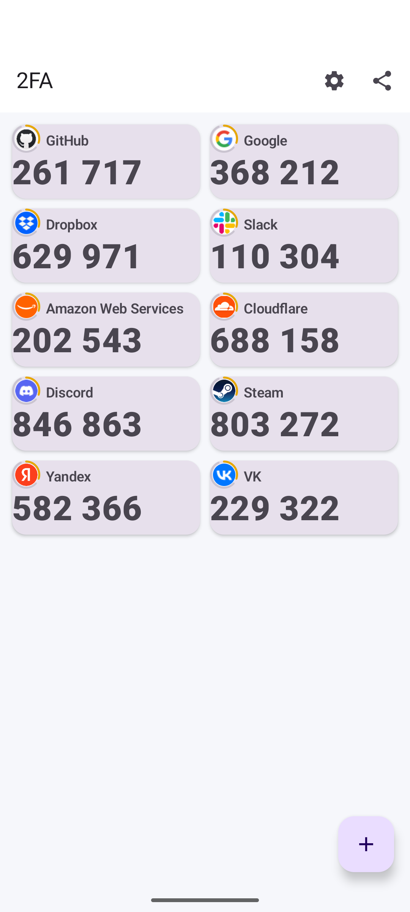

# 2FA

A small, auditable TOTP authenticator for Android: one screen, three real dependencies, and
secrets that never touch the disk in the clear.

Kotlin · Jetpack Compose · Room · ML Kit (QR) · CameraX · Coil — nothing else.

<p align="center">
  
</p>

## What it does

- **One screen.** The list of accounts; each card shows the issuer, the account, the
  current six-digit code and a 30-second ring. Tap a card to copy the code.
- **Raise what you use.** Long-press a card to move it to the top of the list, so the accounts
  you reach for most sit first and stay there across restarts. The same menu deletes.
- **Add by QR or by hand.** Scanning reads `otpauth://totp/…` and rejects anything that is not
  a TOTP URI instead of guessing. Manual entry takes issuer, account and Base32 secret.
- **Import from a Google Authenticator screenshot.** Pick a screenshot, the QR is read with
  ML Kit, and the `otpauth-migration://` payload is decoded without pulling in protobuf: the
  seven-field message is read by a small hand-written reader. Multi-QR exports ("1 of 3") are
  collected across screenshots and only written when the last part arrives; HOTP and MD5
  entries are skipped and counted rather than imported as accounts that would never produce a
  matching code. No media permission is needed — the system PhotoPicker returns one image.
- **Adaptive grid.** One or two columns, chosen in settings — two always in landscape, on
  tablets and foldables.
- **Encrypted export/import.** A password-protected JSON file written through the Storage
  Access Framework — the user picks the folder, the app never asks for broad storage access.
- **Frozen for screenshots.** `FLAG_SECURE` keeps codes out of screenshots and the recents
  thumbnail; the clipboard is wiped 30 s after a copy. The screen is kept awake while the app
  is in the foreground, so codes stay readable while you type them elsewhere.

## Security model, in four lines

1. The Base32 secret of each account is encrypted with **AES-256-GCM** under a key in the
   **Android Keystore** (hardware-backed where available). The database stores ciphertext only.
2. `android:allowBackup="false"` — the database never rides along in Android's cloud backup.
   Encrypted export is the only way data leaves the device.
3. TOTP is RFC 4226/6238 on `javax.crypto`: no third-party crypto code.
4. Export files are PBKDF2-HMAC-SHA256 (210 000 iterations) + AES-256-GCM, so a wrong password
   and a tampered file both fail loudly rather than producing garbage.

The full reasoning — including where this deviates from the original specification and why —
is in [`docs/SPEC.md`](docs/SPEC.md).

## Build

```bash
export ANDROID_HOME=/path/to/android-sdk        # cmdline-tools + platform android-37
export GRADLE_USER_HOME=/path/to/gradle-cache   # keep SDK and cache off the root partition
printf 'sdk.dir=%s\n' "$ANDROID_HOME" > local.properties

./gradlew :app:testDebugUnitTest :app:assembleDebug
```

The APK lands in `app/build/outputs/apk/debug/`. Requires JDK 17+ to launch Gradle; Gradle
brings its own JDK 21 toolchain (foojay resolver). On a small machine, cap the build:

```bash
systemd-run --user --scope -q -p MemoryMax=6G -p MemorySwapMax=1G ./gradlew :app:assembleDebug
```

### Release signing

Create `keystore.properties` in the repository root (gitignored — never commit it):

```properties
storeFile=release.jks
storePassword=…
keyAlias=…
keyPassword=…
```

Without that file, `assembleRelease` produces an unsigned APK. CI does the same thing from
GitHub Secrets; see `.github/workflows/release.yml`. The workflow checks the keystore against
its password before it builds, so a mismatched secret — or one pasted with a trailing newline —
fails in seconds instead of surfacing as a `KeytoolException` inside packaging.

Every release is signed with the same key. Its certificate SHA-256 digest is

```
7D:B0:97:0F:CD:38:21:7B:DA:53:25:63:E0:28:03:E9:0C:99:29:10:A5:5F:2A:7B:C3:7B:FB:9C:A9:D5:8D:01
```

which is what makes an update install over an existing copy. Check a downloaded APK with
`apksigner verify --print-certs app-release.apk`.

## Tests

```bash
./gradlew :app:testDebugUnitTest
```

- `TotpTest` — **RFC 6238 Appendix B vectors** for SHA1, SHA256 and SHA512 (six instants each,
  eight digits). Keys are built from the ASCII bytes the RFC specifies and pushed through our
  own Base32 encoder, so one test covers both the TOTP arithmetic and the Base32 codec.
- `Base32Test` — known encodings, round trips, and tolerance for the way secrets are actually
  pasted (lower case, spaces, dashes, padding).
- `OtpAuthUriTest` — parsing, issuer precedence, defaults, and the rejections (HOTP, non-TOTP
  URIs, missing secret).
- `VaultCodecTest` — export/import round trip, wrong password (`AEADBadTagException`),
  tampered payload, and proof that no secret appears in the clear in the exported file.
- `GoogleAuthMigrationTest` — the Google Authenticator payload. One fixture is written out byte
  by byte straight from the schema, so the reader cannot be validated by the writer that
  produced it; the rest cover the RFC key mapping to its known Base32 string, percent-encoded
  payloads (where a naive URL decoder breaks on `+`), unknown fields, and truncated input.
- `ImagePrepTest` — preparing a screenshot for the detector: luminance, the Otsu threshold
  landing between the two modes of a bimodal image, binarisation producing exactly two colours
  without inverting the picture, and the white border keeping the code and rejecting mismatched
  dimensions instead of silently corrupting the bitmap.

**Проверка на живом образце.** Скриншот QR в репозиторий не кладётся — в нём настоящие
секреты. Поэтому обе проверки берут картинку снаружи:

- `ImagePrepSampleTest` (JVM) читает файл по переменной `OTP_SAMPLE`, прогоняет его через
  подготовку и выгружает варианты по `OTP_SAMPLE_OUT`; без переменной тест пропускается.
  Пример: `OTP_SAMPLE=/path/qr.jpg OTP_SAMPLE_OUT=/tmp/qrcheck ./gradlew :app:testDebugUnitTest`
- `QrSampleImportTest` (инструментальный) прогоняет тот же файл через весь путь импорта,
  включая ML Kit, который на JVM не живёт. Путь передаётся аргументом инструментации:
  `adb shell am instrument -w -e qrFile /data/local/tmp/qr.jpg com.mikhail.authenticator.test/androidx.test.runner.AndroidJUnitRunner`

Network is not needed for the tests.

## Releases

Tag a commit and CI builds the signed APK onto the release:

```bash
git tag v1.0.0 && git push origin v1.0.0
```

Repository secrets required: `KEYSTORE_BASE64`, `KEYSTORE_PASSWORD`, `KEY_ALIAS`,
`KEY_PASSWORD`. Signing runs inside Gradle with the keystore materialised in-job and shredded
afterwards — no third-party action ever receives the key material.

## Not included (on purpose)

HOTP, Aegis/andOTP import (needs scrypt, i.e. another dependency), account groups, autofill,
and biometric app lock. See §6 of `docs/SPEC.md` for the reasoning and what would be involved.

## Licence

Personal project, no licence file yet — ask before reusing.
